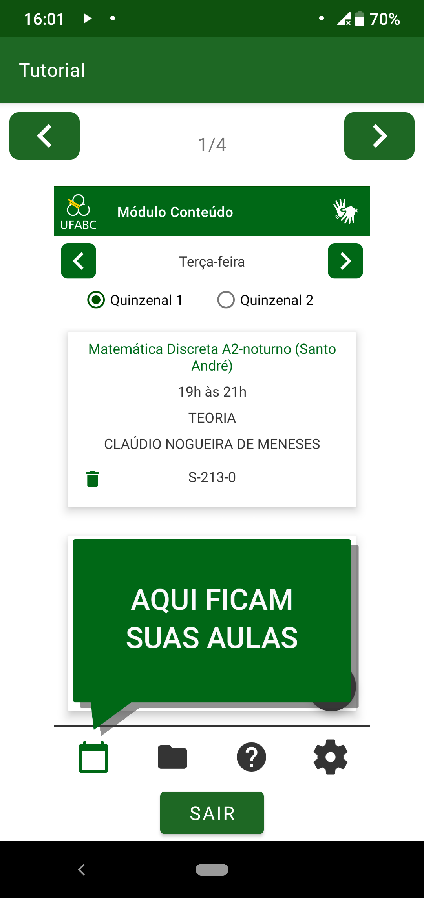

====================
Tutorial por imagens
====================

O tutorial por imagens apresenta uma captura de tela para cada uma das quatro telas disponíveis no app, com um balão indicando a principal funcionalidade delas. A :numref:`im` mostra qual a cara da tela.

.. _im:

  : Tela de tutorial por imagens
