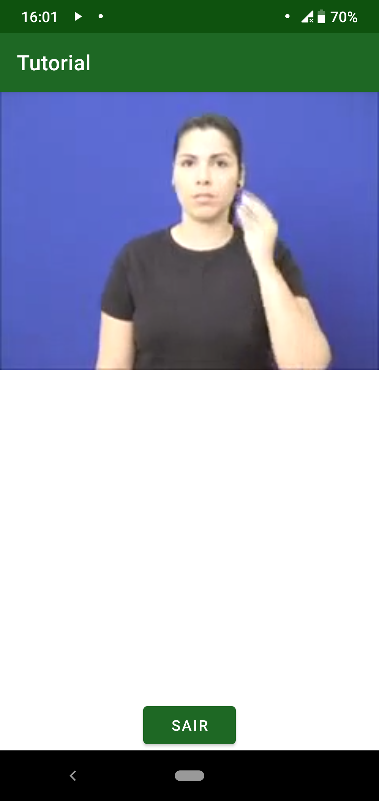

=========================================
Tutorial por video com tradução em libras
=========================================

O tutorial por video com tradução em libras tem a intenção de explicar o funcionamento do aplicativo com um intérprete em libras. Atualmente o video não foi gravado e o arquivo apresentado é apenas de teste. A tela é bem simples e pode ser vista na :numref:`vd`.

.. _vd:

  : Tela de visualização do video em libras

O que precisa ser feito
=======================

Um video real com o tutorial do aplicativo precisa sem gravado com a equipe de tradução, além de mais controles para a reprodução da mídia.
