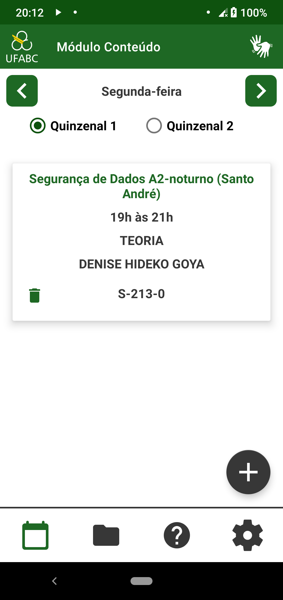
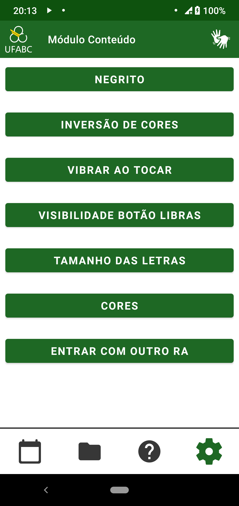

================
Texto em negrito
================

Ter a possibilidade de deixar o texto em negrito é importante para quem possui alguma dificuldade de visão e precisa de linhas mais grossas nas letras. Por isso levamos a sério esse requisito e todos os textos do aplicativo podem ser deixados em negrito. A tela que o usuário escolhe a configuração de negrito pode ser visto na :numref:`fignegrito`.

.. _fignegrito:

    : Tela configurando negrito

A escolha do usuário é armazenada numa variável e, no momento do sistema construir a tela, ele decide a formatação do texto. Na figura :numref:`figHnegrito` e na :numref:`figCnegrito`, temos como exemplo algumas telas com o negrito ativado.

.. _figHnegrito:

    : Tela das aulas em negrito

.. _figCnegrito:

    : Tela de configuração em negrito
