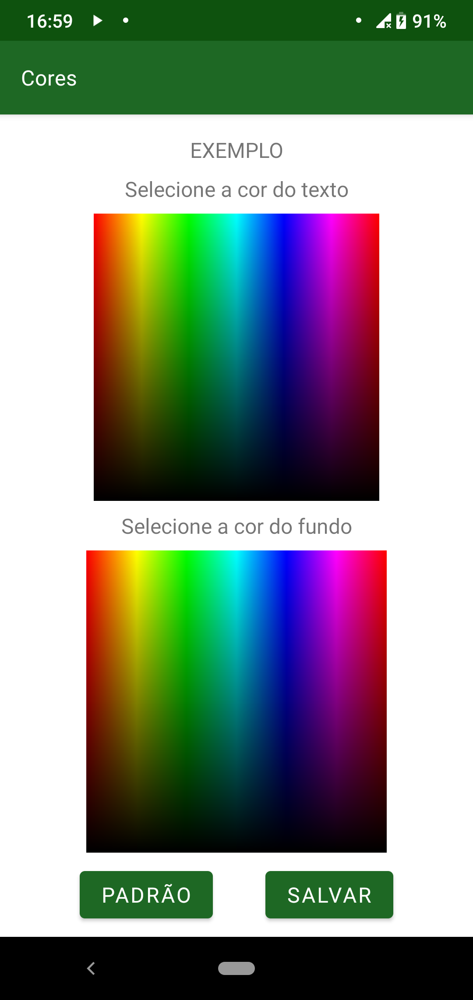

==================
Alteração de cores
==================

A configuração de cores do aplicativo permite o usuário escolher a cor do texto e a cor do fundo do texto. O padrão é texto preto caso o fundo for branco, ou branco quando o fundo é verde. Mas, o usuário pode configurar como quiser esse tipo de opção. Na :numref:`figCores` , podemos ver como o usuário interage com o configurador.

.. _figCores:

    : Tela com as opções de escolha de cor

Funcionalidade
==============

Para escolher qualquer uma das cores que estão disponíveis na paleta, basta clicar com o dedo na região desejada e depois em ``SALVAR``. O texto ``EXEMPLO`` localizado na região superior da tela mostrará como ficarão todas as configurações. Caso desejar voltar para as configurações padrão, simples, basta clicar no botão `PADRÃO`

O que precisa ser feito
=======================

Da forma como está, apenas toques na imagem da paleta são reconhecidos. Se o usuário tocar e arrastar o dedo pela tela, a informação não é captada. Portando, uma melhoria seria aceitar o arraste do dedo na figura.

Outro ajuste que precisa ser melhor configurado é que ao selecionar a cor, o aplicativo precisa ser reiniciado para que todas as funcionalidades tenham sua configuração atualizada de forma correta. Temos a intenção de programar uma maneira de todos os elementos visuais serem recarregados em tempo de execução, sem precisar reiniciar o app.

O que pode melhorar
===================

Também seria interessante obter um retorno da cor que está sendo escolhida numa caixa de diálogo. Outras formas de seleção também podem ser estudadas, como uma seleção inicial de matiz e outra de saturação, para uma escolha mais fina.
