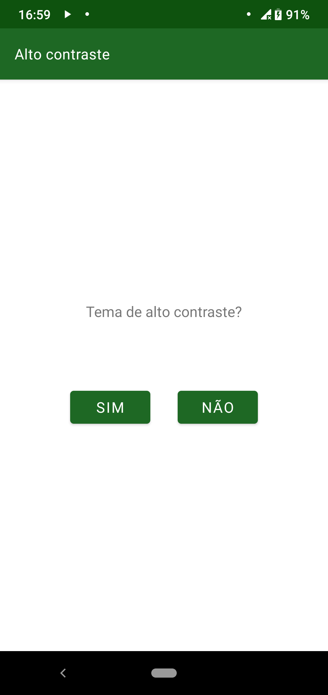
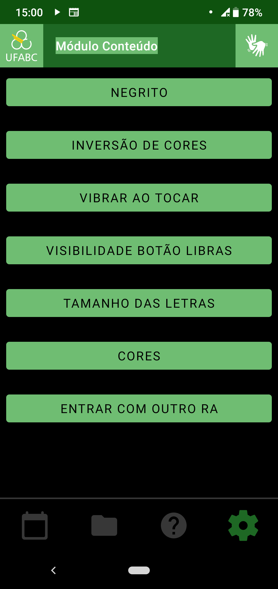
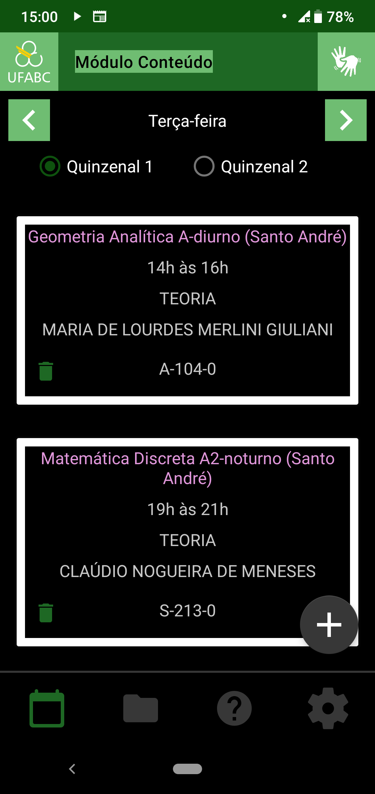

===================
Modo alto contraste
===================

Alto contraste é uma funcionalidade que altera as cores do aplicativo para um modo que melhora a visualização para quem tem alguma dificuldade de visão. O fundo do aplicativo fica preto enquando os textos e botões ficam mais claros. A tela de configuração pode ser vista na figura :numref:`figCores` enquanto exemplos de tela com o modo ativado podem ser vistas em :numref:`fighc` e :numref:`fighch`

.. _figCores:

    : Tela de configuração

.. _fighc:

  : Tela de configuração com o modo alto contraste ativado

.. _fighch:

    : Tela de aulas como o modo alto contraste ativado

O que precisa ser feito
=======================

O aplicativo precisa ser reiniciado para que todas as funcionalidades tenham sua configuração atualizada de forma correta. Temos a intenção de programar uma maneira de todos os elementos visuais serem recarregados em tempo de execução, sem precisar reiniciar o app.

O que pode ser melhorado
========================

Alguns elementos gráficos podem ter a cor alterada de maneiras melhores que ainda não puderam ser testadas com os usuários.
