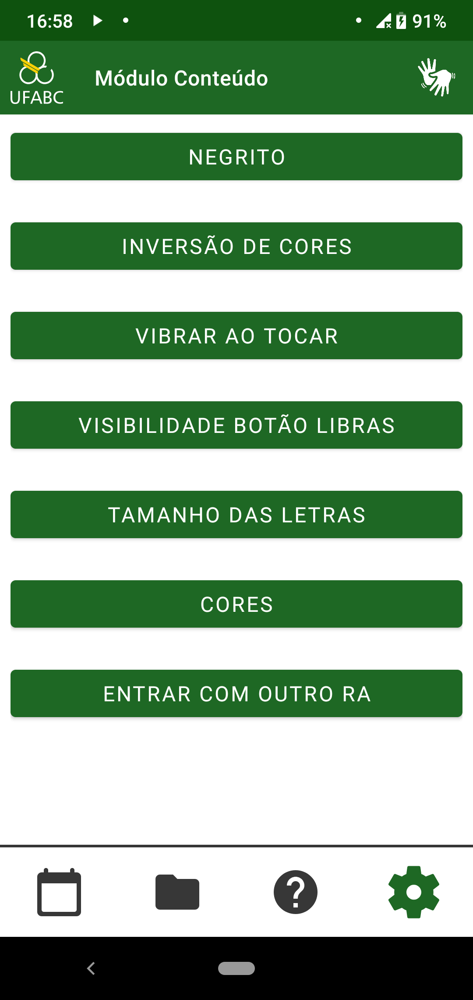

=============
Usar outro RA
=============

Esta configuração permite o usuário carregar os dados de outro registro academico (RA), assim como desejar. Ao clicar no botão ``ENTRAR COM OUTRO RA`` (o ultimo botão que pode ser visto na :numref:`figconfiginicial`), o valor antigo é apagado e a `tela de login <https://modulo-conteudo-docs.readthedocs.io/pt_BR/latest/tela_login/intro.html>`_ é aberta.

.. _figconfiginicial:

    : Menu de configuração
