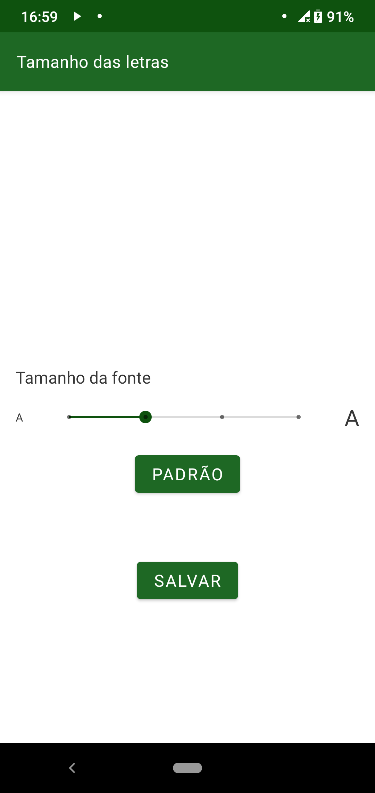

================
Tamanho da letra
================

O tamanho da letra do app pode ser alterado em tempo de execução como o usuário desejar. Basta selecionar na barra de progresso o tamanho desejado. As opções são ``Pequena``, ``Padrão``, ``Grande`` e ``Maior``. Após a escolha do tamanho desejado, clicar em ``SALVAR`` para persistir as alterações. É possivel clicar no botão ``PADRÃO``, que colocara a fonte nas configurações iniciais, que, por sua vez, é o mesmo que deixar a barra de progresso na posição ``Padrão``. A :numref:`tam` mostra como é a tela.

.. _tam:

    : Tela de configuração de tamanho de fonte
