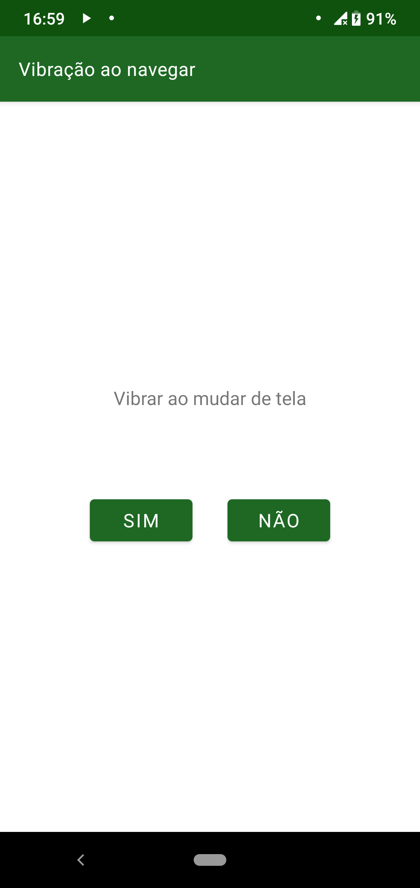

==============================
Retorno tátil ao mudar de tela
==============================

Esta configuração vem desabilitada por padrão e ela apenas permite que o usuário ative a funcionalidade do celular vibrar ao trocar de tela. As opções podem ser vistas na :numref:`vbr`.

.. _vbr:

    : Tela de configuração do retorno tátil.
