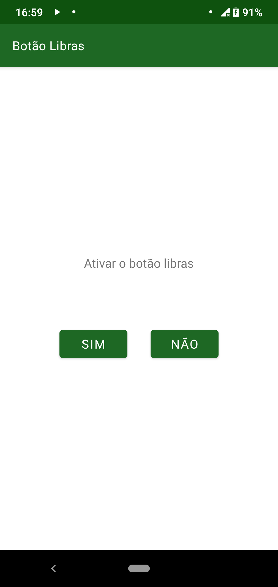

=========================
Visibilidade botão libras
=========================

O botão libras :numref:`btnl`, que fica posicionado na barra superior tem sua visibilidade editável na configuração vista em :numref:`tl`. Ao clicar em ``não``/``sim`` o botão apenas some ou aparece na barra.

.. _btnl:

    : Botão libras na versão em preto (no aplicativo é branco)

.. _tl:

    : Tela de configuração do botão libras
